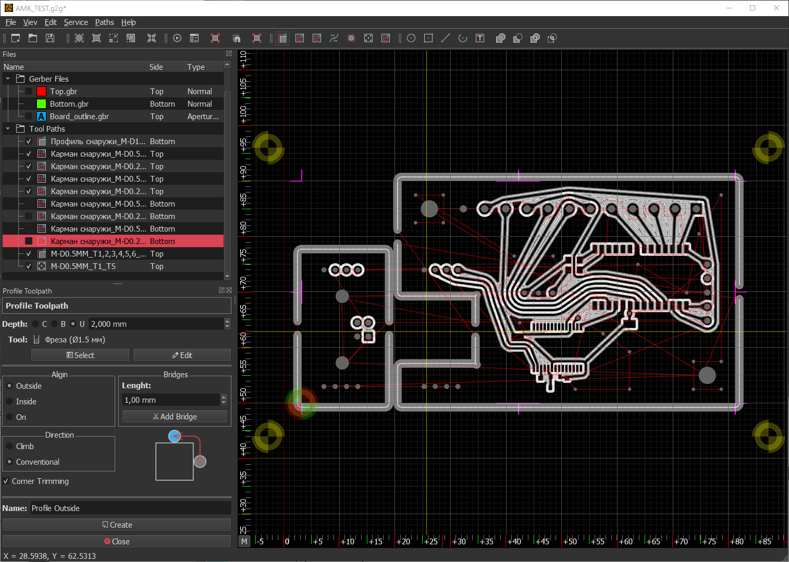

# GERBER_X2
V0.7.8

Программа для подготовки Г-кода из файлов Gerbre для фрезеровки плат на ЧПУ.

Program for preparing G-code from Gerbre files for CNC milling.

* Windows: [x86](https://github.com/XRay3D/GERBER_X2/releases)
* Windows: [amd64](https://github.com/XRay3D/GERBER_X2/releases)

СБЕР 4276 3801 0010 1497

 Yandex Money

 Paypal

 Paypal

