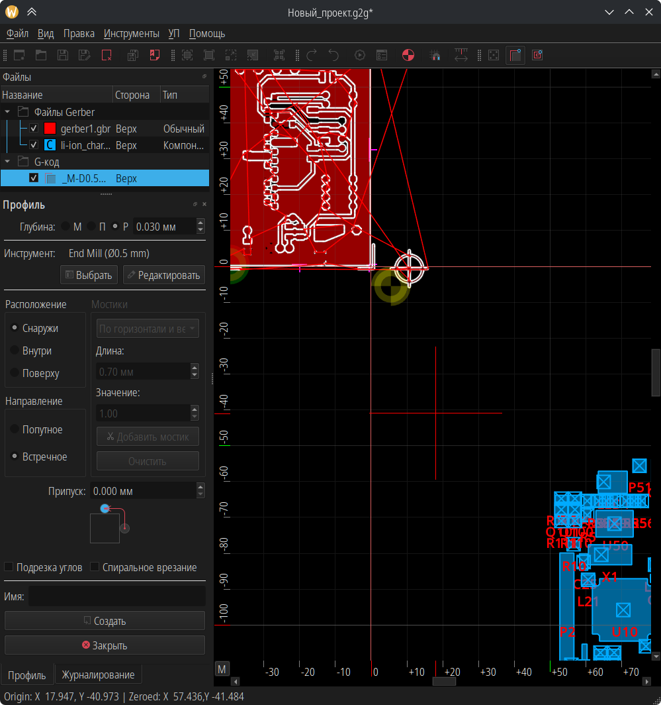
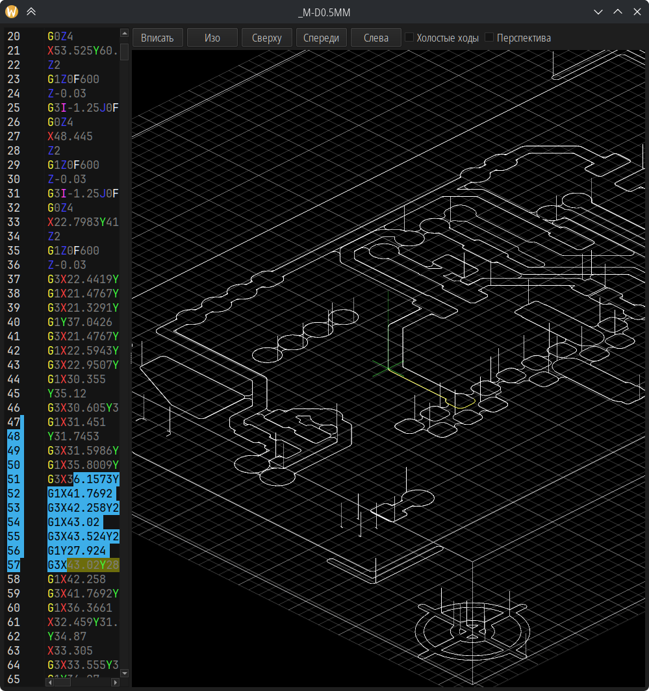
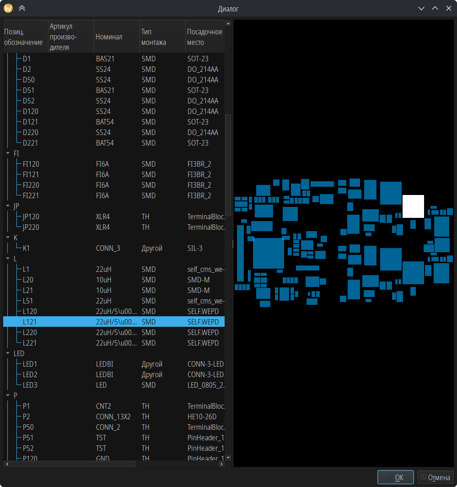

# GGEasy
V0.9.5.0

Программа для подготовки Г-кода из файлов Gerber (RS-274X Revision 2020.09) для фрезеровки плат на ЧПУ.
Частичная поддержка файлов DXF.

Форумы по программе:
* [cnc-club.ru](https://www.cnc-club.ru/forum/viewtopic.php?f=155&t=22277)
* [cnc3018.ru](https://cnc3018.ru/threads/ggeasy-grber2gcode-frezerovka-pechatnyx-plat-na-chpu-zasvetka-lazerom-izuchaem-delimsja-opytom-i-dostizhenijami.2231/)

Program for preparing G-code from Gerber (RS-274X Revision 2020.09) files for CNC milling.
Partial support for DXF files.

Просмотр управляющей программы: текст G-кода и траектория в 3D.

3D preview of the toolpath alongside the G-code text.

Раскладка компонентов из файла Gerber X3 (атрибуты компонентов).

Component placement from a Gerber X3 file (component attributes).

* Windows: [x86](https://github.com/XRay3D/GERBER_X2/releases)
* Windows: [amd64](https://github.com/XRay3D/GERBER_X2/releases)

Поддержать автора https://boosty.to/x-ray_3d
