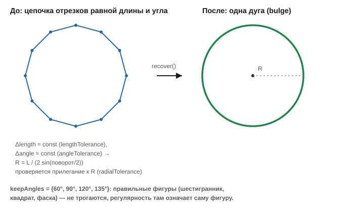

# Восстановление дуг (ArcRecovery)

Заголовок: [`include/geo/arcrecovery.h`](../include/geo/arcrecovery.h).

Экспортёры сплошь и рядом отдают окружность или дугу россыпью коротких
отрезков. Дальше по конвейеру это обходится дорого дважды: каждый отрезок
раздувается собственной капсулой ([офсет](offsetting.md)), а точный свип
CGAL получает на вход сотню почти вырожденных кусков вместо одной кривой.
Настоящая дуга и дешевле, и точнее — CGAL проводит её по опорной
окружности.

```cpp
namespace Geo::ArcRecovery {

Polyline recover(const Polyline& poly, const Settings& settings = {});
void recover(Polylines& polylines, const Settings& settings = {}); // + сшивание
void stitch(Polylines& polylines, const Settings& settings = {});

}
```

`recover` заменяет цепочки отрезков дугами; всё, что регулярным не
оказалось, переносится вершина в вершину без изменений. Перегрузка для
списка полилиний делает то же самое на месте и вместе со сшиванием — на
выходе полилиний может стать меньше, чем было.

## Признак дискретизации

Признак — **регулярность**: подряд идущие отрезки одинаковой длины с
одинаковым углом между ними. Такая цепочка задаёт окружность однозначно —

```
R = L / (2 · sin(поворот / 2))
```

— и остаётся проверить, что вершины на ней и лежат.



Обратная сторона признака: правильный многоугольник от дискретизации
неотличим в принципе — это она и есть, просто грубая. Поэтому углы ходовых
фигур (60°, 90°, 120°, 135° между отрезками — треугольник, квадрат,
шестигранник, фаска) исключены явно (`Settings::keepAngles`), а слишком
крупный шаг (`maxTurnDegrees`) не считается дискретизацией вовсе.

## `Settings`

```cpp
struct Settings {
    bool enabled = true;
    bool stitch = true;
    double stitchTolerance = 1e-6;

    std::size_t minSegments = 3;      // минимум для регулярности
    double lengthTolerance = 1e-3;    // равенство длин, относительный допуск
    double angleTolerance = 0.5;      // равенство углов, градусы

    double radialTolerance = 1e-4;    // отклонение вершин от найденной окружности

    double minTurnDegrees = 1.0;      // ниже -- шум округления координат
    double maxTurnDegrees = 30.0;     // выше -- просто грубая фигура

    std::vector<double> keepAngles = {60.0, 90.0, 120.0, 135.0};
    double keepAngleTolerance = 1.0;

    double fullCircleTolerance = 1.0; // градусы недобора до 360

    std::function<bool(const Polyline&)> accept;
};
```

Ключевые поля:

* **`radialTolerance`** — главная защита от ложного срабатывания: равные
  длины и углы окружность лишь *задают*, а лежат ли на ней сами точки,
  выясняется только здесь. Абсолютное значение, в единицах чертежа: это
  допуск на запись координат, и с радиусом он не растёт — доля радиуса на
  крупной дуге разрешала бы уже заметный сдвиг контура.
* **`minTurnDegrees` / `maxTurnDegrees`** — снизу отсекается шум округления
  координат почти прямой ломаной, сверху — то, что уже просто грубая фигура
  (30° — это уже двенадцатиугольник).
* **`keepAngles`** — углы **между** отрезками (внутренние, `180° − поворот`),
  которые остаются как есть при любой регулярности: треугольник (60°),
  квадрат (90°), шестигранник (120°), фаска (135°) не превращаются в дуги.
* **`fullCircleTolerance`** — замкнутая цепочка, обошедшая полный круг,
  отдаётся окружностью (двумя вершинами с прогибом `±1`), а не дугой —
  см. [почему окружность не выражается одним прогибом](vertex-and-bulge.md#прогиб-bulge).
* **`accept`** — приёмка восстановленного **замкнутого** контура
  вызывающим. Замена сдвигает контур на стрелку дуги — микроны; но прорезь
  в металлизации идёт сама вдоль себя на таком же расстоянии, и этого
  хватает, чтобы контур себя задел. Контур, который был точной геометрии по
  зубам ([`isExactContour`](polygon-and-polygons.md#канон-ориентаций)), а
  после замены перестал, откатывается к ломаной: лучше ломаная, чем вырез,
  целиком выпавший из региона. Пусто — принимать всё; сама `ArcRecovery` о
  точной геометрии ничего не знает.

## `stitch` (ArcRecovery)

```cpp
void stitch(Polylines& polylines, const Settings& settings = {});
```

Сшивание само по себе, отдельно от распознавания: дугу экспортёр разбирает
не только на вершины одной полилинии, но и на россыпь отдельных `LINE` —
пока они врозь, никакой регулярности не видно, и распознавать нечего.
Сшивается только там, где выбора нет: в узле ровно два конца и ширина линий
одинакова; тройная развилка остаётся развилкой. Замкнутой цепочка при этом
**не** становится — сшивание готовит вход для распознавания, а не для
[`Geo::stitch`](normalize.md#stitch--склейка-обрывков) (это разные функции с
разными допусками и разной задачей: та строит регион, эта — цепочки для
`recover`).

## Дальше

* [Нормализация чертёжной геометрии](normalize.md) — следующий шаг после
  `ArcRecovery` для DXF-слоя: `ArcRecovery::recover` даёт правильные дуги,
  `normalize` — правильный канон вложенности.
* [Polyline и Polylines](polyline.md) — `stitchArcs`, соседняя, но другая
  операция: сшивает уже распознанные дуги одной окружности между собой.
