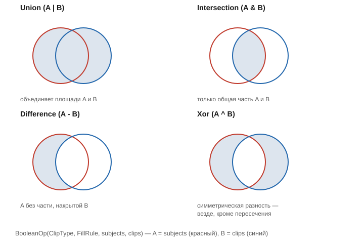

# Булевы операции (BooleanOp)

Заголовок: [`include/geo/boolean.h`](../include/geo/boolean.h).

```cpp
struct BooleanOp_ {
    enum FillRule { EvenOdd, NonZero, Positive, Negative };
    enum ClipType { NoClip, Intersection, Union, Difference, Xor };

    Polygons operator()(ClipType cliptype, FillRule fillrule,
        const Polylines& subjects, const Polylines& clips = {});

    Polygons operator()(ClipType cliptype, FillRule fillrule,
        const Polygons& subjects, const Polygons& clips = {});
} inline BooleanOp;
```

Обе перегрузки — точные, целиком внутри CGAL-домена.

* **Контуры** (`const Polylines&`): вложенность восстанавливается по ней
  самой (как в конструкторе [`Polygons(const Polylines&)`](polygon-and-polygons.md#три-конструктора--три-источника-вложенности)),
  ориентация входа не важна для `FillRule::EvenOdd`.
* **Готовые полигоны** (`const Polygons&`) — то, что вернула предыдущая
  операция: структура известна точно, восстанавливать нечего.

`subjects` — фигура A, `clips` — фигура B. Четыре типа клиппинга:



| `ClipType` | Смысл |
|---|---|
| `Union` | объединение A и B |
| `Intersection` | только общая часть A и B |
| `Difference` | A без части, накрытой B |
| `Xor` | симметрическая разность — везде, кроме пересечения |
| `NoClip` | без клиппинга, только `subjects` под правилом заливки |

```cpp
const Polygons a{Polylines{Geo::rectangle(20.0, 20.0)}};
const Polygons b{Polylines{Geo::circle(10.0, {10, 10})}};

const Polygons merged = BooleanOp(BooleanOp_::Union, BooleanOp_::EvenOdd, a.contours(), b.contours());
// то же самое короче, операторами Polygons:
const Polygons same = a | b;
```

Для готовых `Polygons` операторы `| & - ^ ~` (см. [Polygons](polygon-and-polygons.md#polygons--регион))
— это и есть `BooleanOp` с `FillRule::EvenOdd`, вызывать саму функцию
напрямую нужно в основном тогда, когда вход — ещё не собранный регион, а
свежий плоский список контуров, и нужен конкретный `FillRule`.

## Дальше

* [Резка открытых путей (clipOpen)](clip-open.md) — то, чего у булевых
  операций над площадями нет по построению: у открытой полилинии площади
  нет, резать можно только её саму.
* [Нормализация чертёжной геометрии](normalize.md) — `evenOdd()`, тонкая
  обёртка вокруг `BooleanOp` с `FillRule::EvenOdd` через симметрическую
  разность (XOR).
