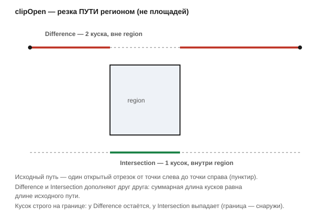

# Резка открытых путей (clipOpen)

Заголовок: [`include/geo/boolean.h`](../include/geo/boolean.h).

```cpp
Polylines clipOpen(ClipType_ clipType, const Polylines& paths, const Polygons& region);
// clipType: только Intersection или Difference
```

Клиппинг **путей** регионом — то, чего у булевых операций над площадями нет
по построению: у открытой полилинии площади нет, резать можно только её
саму. У Clipper2 это был `AddOpenSubject` + `Execute(Difference)`; здесь тот
же примитив, но в bulge-домене: сегмент (отрезок или дуга) режется точками
пересечения с границей региона, а кусок относится по своей **середине** —
чёт/нечет луча в `double`, а в сомнении — точный `Polygons::contains()`
(ошибиться стороной нельзя).

* `Difference` оставляет куски **вне** региона.
* `Intersection` — куски **внутри**.
* Прочие `ClipType` не определены — это единственные два, у которых для
  открытого пути есть смысл.



```cpp
const Polygons square{Polylines{Geo::rectangle(20.0, 20.0)}};
const Polylines path{Polyline{Vertex{-20, 0}, Vertex{20, 0}}};

const Polylines outside = clipOpen(BooleanOp_::Difference, path, square);   // 2 куска, длина 20
const Polylines inside  = clipOpen(BooleanOp_::Intersection, path, square); // 1 кусок, длина 20
```

`Difference` и `Intersection` дополняют друг друга до исходного пути:
суммарная длина кусков равна длине входа.

## Особые случаи

* **Кусок ровно на границе.** `contains()` строг — граница считается
  снаружи, поэтому у `Difference` такой кусок остаётся, у `Intersection`
  выпадает. Путь вдоль ребра региона без настоящих пересечений ведёт себя
  так же: `Difference` возвращает путь целиком, `Intersection` — пусто.
* **Касание без пересечения площади.** Касательная к кругу может дать
  разрез в точке касания, но оба куска лежат по одну сторону — `Difference`
  обязан вернуть путь как есть, без лишней вершины в точке касания.
* **Замкнутый вход.** Замкнутая полилиния подаётся **как путь** (цикл), а
  не как площадь: разрезанная границей, она возвращается **открытыми**
  кусками — шов через стартовую вершину сшивается, лишнего стыка там не
  остаётся. Не тронутая границей вовсе — возвращается замкнутой как есть.
* **Дуги режутся, оставаясь на своей окружности.** Кусок дуги, отрезанный
  границей, сохраняет и вершины, и прогиб — на опорной окружности, с тем же
  центром и радиусом, что и исходная дуга; резка не имеет права стягивать
  дугу в хорду.
* **Шум разреза.** Куски и обрезки короче
  [`exitWeldTolerance`](vertex-and-bulge.md#exitweldtolerance) выбрасываются
  — это шум разреза, а не геометрия.
* **Пустой регион.** `Difference` с пустым регионом возвращает путь как
  есть, `Intersection` — пусто.

## Где используется

`Geo::zigzagFill` строит проход по региону как раз через `clipOpen`: строка
штриховки, упирающаяся в границу, продолжается куском границы до соседней
строки. См. [Заполнение (zigzagFill)](fill.md).

## Дальше

* [Заполнение региона строками (zigzagFill)](fill.md)
* [Vertex и bulge](vertex-and-bulge.md) — `exitWeldTolerance`.
