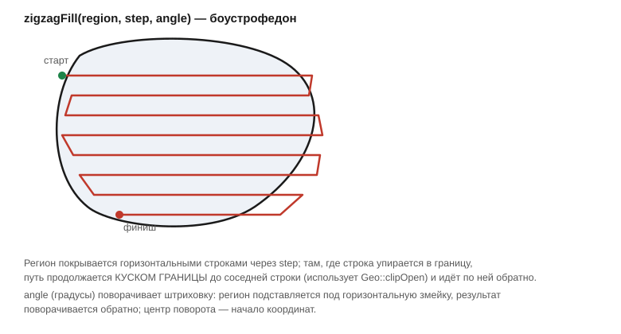

# Заполнение региона строками (zigzagFill)

Заголовок: [`include/geo/fill.h`](../include/geo/fill.h).

```cpp
Polylines zigzagFill(const Polygons& region, double step, double angle = 0.0);
```

Заполнение региона строками — то, что растровые стратегии (выборка,
штриховка) делают поверх булевых операций. Живёт отдельно от
[`boolean.h`](boolean-ops.md): это не операция над регионом, а **готовая
траектория** по нему.

Змейка (боустрофедон): регион покрывается горизонтальными строками через
`step`, и строки сшиваются в непрерывные проходы — там, где строка упирается
в границу, путь продолжается **куском границы** до соседней строки и идёт
по ней обратно. Резка строк на куски внутри региона — это
[`Geo::clipOpen`](clip-open.md); прежде то же самое собиралось Clipper2 в
каждом растровом плагине по отдельности.



```cpp
const Polygons pocket = ...;
const Polylines toolpath = zigzagFill(pocket, tool.diameter() * 0.6);
```

`angle` (градусы, как и везде в Qt) поворачивает штриховку: регион
подставляется под горизонтальную змейку, результат поворачивается обратно;
центр поворота — начало координат, на форму заполнения он не влияет.

```cpp
const Polylines diagonal = zigzagFill(pocket, step, 45.0);
```

Куски сшиваются по совпадению концов в пределах
[`exitWeldTolerance`](vertex-and-bulge.md#exitweldtolerance) — точки разреза
считаются в `double`, бит-в-бит они не сходятся.

Граничные случаи:

* Пустой регион даёт пустой список.
* Шаг шире региона даёт одну строку посередине, а не пустоту.

## Дальше

* [Резка открытых путей (clipOpen)](clip-open.md) — примитив, которым
  строки сшиваются с границей.
* [Раздутие и сжатие (Inflate)](offsetting.md) — концентрические витки
  (pocket) собираются им же, `zigzagFill` — альтернативная стратегия
  заполнения для тех же регионов.
