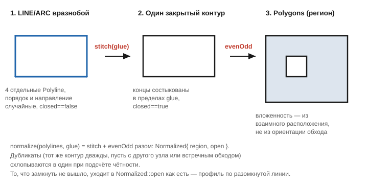

# Нормализация чертёжной геометрии

Заголовок: [`include/geo/boolean.h`](../include/geo/boolean.h).

Конструкторы `Polygons` ждут канон: замкнутость флагом, вложенность —
ориентацией обхода (контур с отрицательной площадью читается как пустота
внутри чьего-то тела; см. [канон Polygon](polygon-and-polygons.md#канон-ориентаций)).
Gerber приходит именно таким, а **чертёж (DXF) — нет**:

* **ориентация в DXF произвольна.** Один и тот же прямоугольник рисуется и
  по часовой, и против — для чертежа это одна и та же рамка. В канон Geo он
  попадает как пустота, вычитать её не из чего — и регион выходит пустым.
  Ровно поэтому из слоя DXF в g-код доходили одни окружности:
  `Geo::circle()` строит их против часовой, а всё нарисованное вручную —
  как придётся;
* **контур разрезан на сущности.** Габарит платы — это десяток отдельных
  `LINE` и `ARC`, у каждого из которых замкнутости нет вовсе.

Отсюда два шага — `stitch` и `evenOdd` — и `normalize` как их связка.



## `stitch` — склейка обрывков

```cpp
void stitch(Polylines& polylines, double glue);
```

Склеивает контуры, у которых концы отстоят не дальше `glue`: обрывки из
файла обычно и есть один разрезанный контур. Замкнувшийся сам на себя
помечается `closed`. Порядок и ориентация входа значения не имеют.

`glue` — допуск, а не ноль: у чертежа концы соседних сущностей сходятся не
побитово.

```cpp
Polylines pieces{
    Polyline{{0, 0}, {0, 10}},
    Polyline{{20, 10}, {20, 0}},  // порядок и направление вразнобой
    Polyline{{0, 10}, {20, 10}},
    Polyline{{20, 0}, {0, 0}},
};
stitch(pieces, exitWeldTolerance); // -> один closed-контур, площадь 200
```

## `evenOdd` — регион по чётности накрытий

```cpp
Polygons evenOdd(const Polylines& contours);
```

Регион по правилу even-odd: точка внутри, если её накрывает **нечётное**
число контуров. Вложенность берётся из взаимного расположения, ориентация
обхода не значит ничего — каждый контур входит телом.

Считается как симметрическая разность (`Xor` в терминах
[`BooleanOp`](boolean-ops.md)) всех контуров разом: `Xor` и есть «нечётное
число раз». Все операции точные, домен CGAL не покидается.

Разомкнутые и вырожденные контуры пропускаются — площади у них нет.

**Дубликаты схлопываются.** Из совпадающих контуров (та же граница, пусть с
другого стартового узла или встречным обходом) в счёт чётности входит
**один**: контур, обведённый дважды, — обычный мусор чертежа, а не пустота,
в которую его превратил бы буквальный `Xor`.

```cpp
const Polygons ccw = evenOdd(Polylines{rect(0, 0, 20, 10, /*ccw=*/true)});
const Polygons cw  = evenOdd(Polylines{rect(0, 0, 20, 10, /*ccw=*/false)});
// ccw.area() == cw.area() == 200 -- ориентация входа не важна
```

Вложенность распознаётся по расположению, а не по ориентации: круг внутри
прямоугольника — дырка независимо от того, как он обойдён, потому что
накрывается дважды.

## `normalize` — склейка + even-odd разом

```cpp
struct Normalized {
    Polygons region; // всё, что удалось замкнуть
    Polylines open;  // что замкнуть не вышло -- профиль по разомкнутой линии
};

Normalized normalize(Polylines polylines, double glue);
```

Замкнутое (сразу или после склейки) уходит в `region`, остальное — в
`open`. То, что замкнуть не вышло, не теряется: профиль по разомкнутой
линии — такая же законная траектория, просто без площади.

```cpp
const Normalized norm = normalize(dxfLayerZeroFragments, exitWeldTolerance);
// norm.region -- всё, что стало телами и дырками
// norm.open   -- разомкнутые линии как есть
```

## Реальный кейс

Тест [`realDxfLayerZero`](../tests/test_normalize.cpp) воспроизводит слой
"0" реального DXF-файла: три окружности (обход против часовой, как их
строит `Geo::circle`) и четыре замкнутые `LWPOLYLINE` (обход по часовой, как
нарисовал чертёжник). Собранные наивно (`Polygons{contours}`, канон Geo),
они дают **пустой** регион — рамка обойдена по часовой, читается пустотой и
вычитает всё, что внутри неё, вместе со всеми тремя окружностями. Через
`evenOdd` слой раскладывается в три тела: рамку с четырьмя дырками (три
отверстия и внутренняя рамка) и два отдельных прямоугольника.

## Дальше

* [Polygon и Polygons](polygon-and-polygons.md) — канон, который эти
  функции приводят чертёж к соответствию.
* [Восстановление дуг](arc-recovery.md) — ещё один шаг подготовки
  импортированной геометрии, обычно перед нормализацией.
