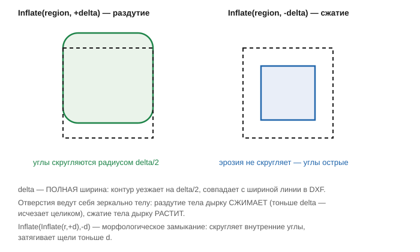

# Раздутие и сжатие (Inflate)

Заголовок: [`include/geo/boolean.h`](../include/geo/boolean.h).

```cpp
struct Inflate_ {
    Polygons operator()(const Polylines& polylines, double delta) const;
    Polygons operator()(const Polylines& polylines) const; // своя ширина на линию
    Polygons operator()(const Polygons& region, double delta) const;
} inline Inflate;
```

`Inflate` — офсет геометрии на `delta/2`: **наружу** при `delta > 0` и
**внутрь** при `delta < 0`. Результат всегда `Polygons` — тело со всеми
его дырками, а не набор контуров, чью вложенность пришлось бы
восстанавливать вызывающему.

Делится пополам потому, что `delta` — **полная ширина**: число совпадает с
шириной линии в DXF, а контур уезжает на её половину.



Обе стороны — одна и та же полоса вдоль границы
([`Polygons::boundaryBand`](polygon-and-polygons.md#boundaryband)) шириной
`2 * |delta| / 2`, только раздувание её **прибавляет**, а сжатие
**вычитает**. Раздутие обходит углы диском радиуса `delta/2` (скругление),
сжатие — эрозия диском, углы остаются острыми, скруглять при сжатии нечему.

Отверстия при этом ведут себя **зеркально** телу: раздувание тела дырку
сжимает (дырка тоньше `delta` исчезает целиком), сжатие тела — дырку
растит.

## Три перегрузки

**Плоский список контуров**, общая дельта:

```cpp
Polygons operator()(const Polylines& polylines, double delta) const;
```

Ориентация **входных** контуров значима, потому что в плоском списке ею
одной и выражается вложенность: контур с положительной площадью — тело, с
отрицательной — пустота внутри чьего-то тела ([канон](polygon-and-polygons.md#канон-ориентаций)).
Поэтому весь слой стоит подавать одним вызовом: пустота, поданная отдельно
от своего тела, вычитать ей нечего, и результат будет пуст.

При `delta > 0` раздуваются и **открытые** контуры: площади у них нет, но
капсулы их рёбер дают привычный «штрих» шириной `delta`. При `delta < 0`
они не значат ничего — сжимать у линии нечего.

**Плоский список, своя ширина на линию:**

```cpp
Polygons operator()(const Polylines& polylines) const;
```

Каждая полилиния раздувается на свою собственную ширину
(`Geo::Polyline::width`) — обычный случай для слоя, пришедшего из DXF.
Ширина — величина неотрицательная, поэтому сжатия здесь нет.

**Готовый регион:**

```cpp
Polygons operator()(const Polygons& region, double delta) const;
```

Результат прежней операции. Цепочка (раздуть → объединить → сжать) не
выходит из точного домена, так что строить её можно сколь угодно длинной; в
частности, `Inflate(Inflate(r, +d), -d)` — это честное морфологическое
**замыкание**, скругляющее внутренние углы и затягивающее щели тоньше `d`.
Симметрично, `Inflate(Inflate(r, -d), +d)` — морфологическое **открытие**.

```cpp
// pocket: концентрические витки внутрь диска
Polygons region = ...;
for(int i = 1; i <= steps; ++i) {
    const Polygons loop = Inflate(region, -stepover * i);
    if(loop.empty()) break; // эрозия толще фигуры -- законный пустой ответ
    // ... виток заливки ...
}
```

## Дуга под офсетом

Дуга радиусом меньше офсета — случай, на котором внутренняя окружность
вырождается: раньше её резали на хорды и раздували каждую отдельно,
получая вместо одной дуги цепочку колпачков, разделённых прямыми. Сейчас
дуга остаётся одной дугой независимо от соотношения её радиуса и `delta`
(см. тест [`arcSmallerThanOffsetStaysOneArc`](../tests/test_inflate.cpp)).

Окружность, сжатая до нового радиуса, остаётся каноническими **двумя**
вершинами с прогибом `±1` — так её выводит одной командой G-код и так её
пересобирает поворот начала обхода (см. тест
[`shrunkDiscKeepsTwoVertices`](../tests/test_inflate.cpp)).

## Дальше

* [Булевы операции](boolean-ops.md)
* [Отмена долгих вычислений](cancellation.md) — `Inflate` на большом
  регионе может идти секунды, отмена кооперативна между кусками дерева
  слияний.
