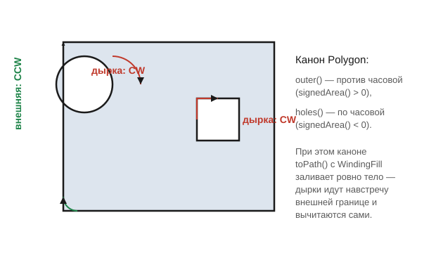
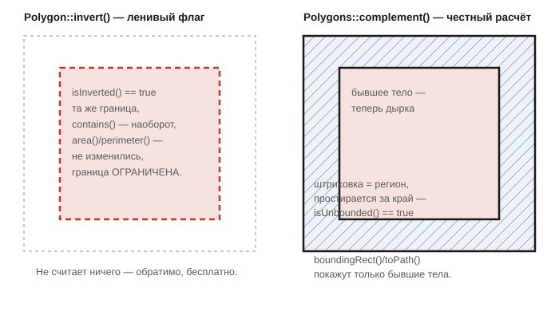
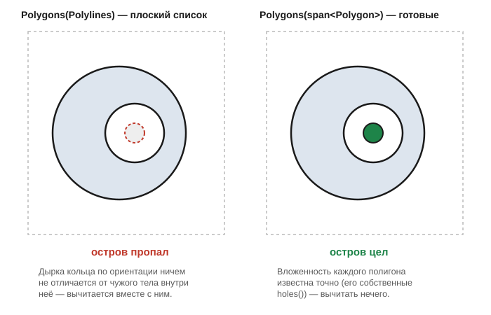

# Polygon и Polygons — точный домен

Заголовок: [`include/geo/polygon.h`](../include/geo/polygon.h).

`Polygon` и `Polygons` — обёртки над CGAL. Хранимое состояние здесь —
точное (рациональное) представление CGAL: `Polygon_with_holes_2` у
`Polygon` и `General_polygon_set_2` у `Polygons`. Наружу геометрия
отдаётся только путём Qt (`toPath()`) — обратного перевода в bulge-вид
(`Geo::Polyline`) здесь нет, он и не нужен никому: как только результат
операции возвращается в `Polyline`, теряется точность, и дальнейшая цепочка
операций (раздуть → объединить → вычесть) накапливает ошибку. Пока
геометрия живёт в CGAL-домене, центры и радиусы дуг проходят её
неизменными, а самокасания не возникают вовсе.

CGAL спрятан за PIMPL: заголовки тяжёлые (EPECK + GMP), тянуть их в каждый
файл проекта незачем. Держится он в `std::indirect` — PIMPL со
**значенийной** семантикой: копирование, перемещение и уничтожение
достаются готовыми, а `const` прокидывается внутрь, так что константный
`Polygon` не отдаёт неконстантную ссылку на своё нутро.

## Канон ориентаций

`Polygon` — одна внешняя граница плюс сколько угодно дырок внутри неё.
Плоский список полилиний такого не выражает — там дырка такой же контур,
как всё прочее, и связывать её со «своим» телом приходится вызывающему.

Канон Geo — DXF-вида: внешняя граница обходится **против часовой**
(`signedArea() > 0`), дырки — **по часовой**. При этом каноне `toPath()` с
`WindingFill` заливает ровно тело полигона: дырки идут навстречу внешней
границе и вычитаются сами.



```cpp
Polyline hole = Geo::circle(8.0);
hole.reverse(); // дырка -- навстречу телу
const Polygon body{Geo::rectangle(20.0, 20.0), {hole}};
```

`isExactContour(const Polyline&)` проверяет, возьмёт ли точная геометрия
данный контур: замкнут, невырожден и не касается сам себя. Ровно этот
отбор идёт внутри `Polygons` — контур, не прошедший его, в регион просто не
попадает. Вынесена наружу ради тех, кто контуры **правит**
([`ArcRecovery`](arc-recovery.md)): им нужно узнать, не сделала ли правка
контур непригодным, не таща к себе заголовки CGAL.

## `Polygon`

```cpp
class Polygon {
public:
    explicit Polygon(const Polyline& outer, const Polylines& holes = {});

    bool empty() const;
    const Polyline& outer() const;   // материализуется и кэшируется
    const Polylines& holes() const;  // материализуется и кэшируется
    Polylines contours() const;      // внешний, затем дырки

    double area() const;      // тело: внешняя минус дырки
    double perimeter() const; // вся граница: внешняя плюс дырки
    QRectF boundingRect() const;
    bool contains(QPointF point) const;

    bool isUnbounded() const;
    Polygons complement() const;

    bool isInverted() const;
    Polygon& invert();

    QPainterPath toPath() const;
};
```

`outer()`/`holes()`/`contours()` материализуются из точного представления
при первом обращении и кэшируются — обращение к ним не бесплатно только
один раз.

### `invert()` — ленивая пометка «это пустота»

`invert()` **ничего не считает** — она только переключает флаг, поэтому
бесплатна и обратима без потерь. Флаг видно снаружи всюду, где форма
покидает точный домен:

* `outer()`/`holes()`/`contours()` отдают контуры **обратного** обхода —
  именно так плоский список полилиний и выражает пустоту;
* при сборке региона (конструкторы `Polygons`) такой полигон
  **вычитается** из прочих, а не объединяется с ними;
* `contains()` отвечает наоборот;
* `toPath()` строит путь встречного направления — добавленный к чужому
  пути с `WindingFill`, он из него вычтется;
* сериализация флаг сохраняет ([Сериализация](serialization.md)).

Габарит, периметр и площадь **не меняются**: граница та же самая, и
`empty()` тоже говорит о хранимом теле, а не о том, что оно означает.

### `complement()` — настоящее дополнение

`complement()` — это уже не флаг, а честно посчитанный регион: всё, что
**вне** полигона. Результат — `Polygons`, а не `Polygon`: дополнение тела с
дырками — это неограниченная часть плоскости плюс по отдельному телу на
каждую дырку, а одним `Polygon_with_holes_2` столько кусков не выразить.



Это принципиально разные операции, и путать их нельзя:

| | `Polygon::invert()` | `Polygon::complement()` / `Polygons::invert()` |
|---|---|---|
| Считает | ничего, только флаг | настоящую границу дополнения |
| Результат | `Polygon`, ограничен | `Polygons`, **неограничен** |
| Смысл | «это дырка внутри чьего-то тела» | «вся плоскость снаружи» |
| Стоимость | бесплатно | вычисление CGAL |

Разница неустранима: обратный обход контура означает «дырка внутри чьего-то
тела», а не «вся плоскость снаружи», и в плоский список полилиний настоящее
дополнение не укладывается вовсе. Нужно именно оно — `complement()`.

## `Polygons` — регион

```cpp
class Polygons {
public:
    Polygons(std::initializer_list<Polygon> polygons);
    explicit Polygons(const Polygon& polygon);
    explicit Polygons(std::span<const Polygon> polygons);
    explicit Polygons(const Polylines& contours);

    bool empty() const;
    std::size_t size() const;
    const std::vector<Polygon>& all() const; // материализуется, кэшируется
    Polylines contours() const;               // плоский список всех контуров

    double area() const;
    QRectF boundingRect() const;
    bool contains(QPointF point) const;
    QPainterPath toPath() const;

    Polygons boundaryBand(double radius) const;

    Polygons& operator|=(const Polygons&); // объединение
    Polygons& operator&=(const Polygons&); // пересечение
    Polygons& operator-=(const Polygons&); // разность
    Polygons& operator^=(const Polygons&); // симметрическая разность
    Polygons& invert();                     // дополнение, на месте

    bool isUnbounded() const;
};
```

`Polygons` — регион (в терминах CGAL, `General_polygon_set_2`), а не просто
вектор: булевы операции над ним точные и выполняются, не выходя из
CGAL-домена, поэтому цепочку операций можно строить сколь угодно длинной
без потери точности. Операторы `| & - ^ ~` — тонкие обёртки над
`operator|=` и т. д.

### Три конструктора — три источника вложенности

**Плоский список контуров** (`explicit Polygons(const Polylines&)`) —
вложенность выражена **одной ориентацией**: контур с отрицательной площадью
читается как пустота внутри чьего-то тела. Подходит, когда геометрия
пришла как есть из Gerber или после нормализации DXF
([Нормализация](normalize.md)).

**Готовые полигоны** (`explicit Polygons(std::span<const Polygon>)` и
конструктор от `initializer_list`) — из уже собранных `Polygon` с
известными дырками, объединением, деревом слияний, в несколько потоков.
Это **единственный** способ собрать регион из многих кусков, не теряя их
вложенности. У плоского списка контуров вложенность выражена одной
ориентацией — и дырка одного тела вычитает чужое тело, лежащее внутри неё.

Классический пример — репер платы (кольцо, а внутри его дырки — отдельная
окружность). В плоском списке контуров дырка кольца ничем не отличается по
ориентации от чужого тела внутри неё — и остров пропадает вместе с дыркой.
Собранный из готовых полигонов (`span<Polygon>`), регион знает вложенность
каждого куска точно и ничего лишнего не вычитает:



```cpp
Polyline hole = Geo::circle(12.0);
hole.reverse();
const Polygon ring{Geo::circle(20.0), {hole}};
const Polygon dot{Geo::circle(4.0)}; // лежит внутри дырки кольца

const std::vector<Polygon> parts{ring, dot};
const Polygons region{std::span<const Polygon>{parts}}; // остров цел
```

Полигоны, помеченные `isInverted()`, при сборке региона **вычитаются**, и
все разом — после тел, как и в конструкторе от `initializer_list`.

### `boundaryBand`

```cpp
Polygons boundaryBand(double radius) const;
```

Сумма Минковского **границы** региона с кругом радиуса `radius` — полоса
толщиной `2 * radius` вдоль всей границы, и внешней, и границ отверстий.
Это общий кирпич обоих направлений офсета (см. [Раздутие/сжатие](offsetting.md)):
раздутый регион — это он же, объединённый с самим регионом; сжатый —
вычтенный из него. Точка остаётся в сжатом регионе ровно тогда, когда она в
регионе и дальше `radius` от его границы, то есть вне полосы, — так что
вычитание и есть эрозия, без всякого приближения.

### `invert()` региона и `isUnbounded()`

`Polygons::invert()` — точная инверсия на месте: точка попадает в результат
ровно тогда, когда не попадала в исходный. Как и прочие булевы операции,
идёт не выходя из CGAL, так что двойная инверсия — тождество, а не
приближение к нему.

Результат **неограничен**, если исходный регион был ограничен, а
неограниченному куску нечего отдать ни в габарит, ни в путь Qt —
`boundingRect()` и `toPath()` покажут лишь бывшие тела, ставшие дырками.
Инверсия — операция **промежуточная**: её место внутри цепочки, где следом
идёт пересечение с чем-то конечным (рамкой, заготовкой). Ровно поэтому
вырезы в g-коде считаются как «рамка минус медь», а не как инверсия меди.

`isUnbounded()` — проверка для тех, кто собирается регион рисовать, мерить
или сохранять: у неограниченного региона габарит и путь неполны, а
сериализация через контуры его теряет.

## Дальше

* [Раздутие и сжатие (Inflate)](offsetting.md)
* [Булевы операции](boolean-ops.md)
* [Резка открытых путей (clipOpen)](clip-open.md)
* [Сериализация](serialization.md) — как `Polygon`/`Polygons` пишутся в JSON.
