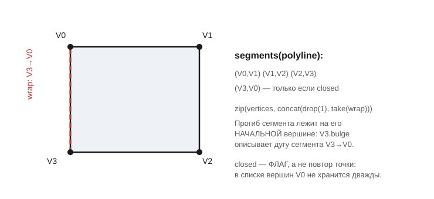

# Polyline и Polylines

Заголовки: [`include/geo/polyline.h`](../include/geo/polyline.h),
[`include/geo/util.h`](../include/geo/util.h).

`Polyline` — плоский bulge-вид контура: `std::vector<Vertex>` плюс два
флага. Это единственное представление геометрии в Geo, которое считается в
`double` и работает с данными напрямую, без выхода в точный CGAL-домен
(тот начинается в [`Polygon`/`Polygons`](polygon-and-polygons.md)).

```cpp
struct Polyline : std::vector<Vertex> {
    Polyline(const QPolygonF& pgn);

    bool closed{};
    double width{}; // constant line width (DXF group 43); 0 == unspecified

    QPainterPath toPath() const;
    operator QPolygonF() const;

    void reverse();
    Polyline reversed() const;
    Polyline& close();

    double signedArea() const;  // требует closed
    double area() const;        // требует closed
    QRectF boundingRect() const;
    double perimeter() const;

    bool isClosed() const;
    bool isPositive() const; // signedArea() > 0
};

struct Polylines : std::vector<Polyline> {
    QPainterPath toPath() const;
};
```

## `closed` — флаг, а не повтор точки

Замкнутость контура — булев флаг, а **не** дублирование первой вершины в
конце списка. `Polyline::close()` выставляет флаг и, если последняя вершина
дублирует первую, убирает дубликат. Парсеры (DXF, Gerber) обычно приносят
контур как раз с повтором — `close()` нормализует его к канону Geo.

## Мерки контура — точные, с учётом дуг

`signedArea()`, `area()`, `perimeter()` и `boundingRect()` учитывают дуговые
сегменты, а не только хорды между вершинами:

* `signedArea()` — знаковая площадь **замкнутой** полилинии; знак отличает
  внешнюю границу от отверстия (см. [канон Polygon](polygon-and-polygons.md#канон-ориентаций)).
  К обычной формуле шнурков по вершинам прибавляется знаковая площадь
  каждого кругового сегмента (`Arc::segmentArea()`).
* `boundingRect()` — точный, а не по одним вершинам: дуга выпирает за
  хорду, и её крайние точки (там, где касательная горизонтальна или
  вертикальна) учитываются, когда попадают в размах. Четверть окружности
  радиуса `R` в первом квадранте даёт габарит `[0, R] × [0, R]`, а не
  габарит опорного круга.
* `perimeter()` — для дугового сегмента берётся длина самой дуги
  (`Arc::length()`), а не длина хорды.

## `reverse()` / `reversed()`

Разворачивает полилинию в обратном направлении: порядок вершин
переворачивается, а прогибы переносятся на новый «исходящий» сегмент **с
обратным знаком** — так форма контура (включая дуги) остаётся прежней,
только пройденной в обратную сторону. `reverse()` — на месте, `reversed()`
— копией, для выражений, где разворачивать исходник нельзя.

## `segments()` — сегменты парами вершин

```cpp
inline auto segments(const Polyline& polyline);
```

Прогиб сегмента лежит на его **начальной** вершине, поэтому по одной
вершине сегмент не восстановить. `segments()` отдаёт представление — пары
ссылок на сами вершины, без копий и без единого выделения памяти (раньше
здесь собирался вектор пар — 48 байт на сегмент за вызов, а вызывается это
на каждый путь при выводе управляющей программы).



У **замкнутой** полилинии последним идёт сегмент от последней вершины к
первой — тот самый, которого нет в списке вершин. Реализация — `zip`
вершин со сдвинутой на один копией списка (`concat(drop(1), take(wrap))`,
где `wrap` — 1 для замкнутой, 0 для открытой):

```cpp
for(auto&& [from, to]: Geo::segments(polyline)) {
    // from, to -- Vertex&
}
```

Представление **ссылается** на полилинию и не должно жить дольше неё; в
`range-for` это безопасно (C++23 продлевает жизнь временного объекта на
весь цикл), но сохранять его в переменную дольше самой полилинии нельзя.

## `stitchArcs`

```cpp
void stitchArcs(Polyline& polyline, double tolerance = exitWeldTolerance);
```

Сшивает подряд идущие дуги одной окружности в одну: соседние вершины, чьи
дуги сходятся центром и радиусом в пределах `tolerance` и идут в одну
сторону, заменяются одной вершиной с суммарным размахом.

Нужна потому, что дуга приходит нарезанной: точный свип CGAL рубит границу
по вертикальным касательным, а офсет складывает её из отдельных капсул. Для
вывода это по-прежнему одна дуга — и на экране, и в G-коде (`G2`/`G3` одной
строкой вместо десятка). Прогиб больше единицы — законная дуга больше
полуокружности; не выражается прогибом только **полный** оборот, поэтому
окружность так и остаётся двумя половинами. Замыкающая пара (последняя
вершина — первая) не трогается: сшивка там сдвинула бы начало контура, а им
задана врезка.

## Примитивы

Все замкнуты, обойдены против часовой стрелки (`signedArea() > 0`) и
хранят **дуги**, а не ломаные — до самого выхода в CGAL или на экран
огрублять их незачем.

```cpp
Polyline circle(double diameter, QPointF center = {});
Polyline rectangle(double width, double height, QPointF center = {});
Polyline obround(double width, double height, QPointF center = {});
Polyline arc(QPointF center, double radius, double startAngle, double sweep);
```

* `circle` — **две** полуокружности с прогибом `1`: полный оборот прогибом
  не выражается (`tan(2π/4)` — бесконечность). Любой код, читающий контуры
  Geo, обязан быть готов увидеть окружность как ровно две вершины — pocket
  и вывод УП полагаются на этот канон (см. тест
  [`shrunkDiscKeepsTwoVertices`](../tests/test_inflate.cpp)).
* `obround` — прямоугольник со скруглёнными торцами по короткой стороне,
  апертура Gerber «obround». При `width == height` вырождается в
  окружность.
* `arc` — дуга по центру и знаковому размаху (радианы, `> 0` — против
  часовой). Режется на куски не длиннее полуокружности — иначе прогиб уходит
  в бесконечность. `|sweep| >= 2π` даёт замкнутую окружность.

## Пути Qt

```cpp
Polylines fromPath(const QPainterPath& path, double tolerance = 5e-3);
QPainterPath toPath(const Polylines& polylines);
```

`fromPath` восстанавливает контуры из `QPainterPath`: кубики, оказавшиеся
дугой окружности, возвращаются в bulge-вид, остальные дробятся на отрезки
не грубее `tolerance`. `toPath` — обратная операция, все контуры одним
путём, каждый своим подпутём; заливка зависит от правила заполнения,
которое выставляет уже вызывающий — набор контуров сам по себе не говорит,
где тело, а где дырка (для этого и нужен [`Polygon`](polygon-and-polygons.md)).

## Дальше

* [Polygon и Polygons](polygon-and-polygons.md) — точный домен, куда
  контуры попадают через конструкторы.
* [Нормализация чертёжной геометрии](normalize.md) — склейка обрывков
  (`stitch`, не путать со `stitchArcs`) и `evenOdd` для контуров без канона.
* [Восстановление дуг](arc-recovery.md) — обратный путь: ломаная → дуга.
