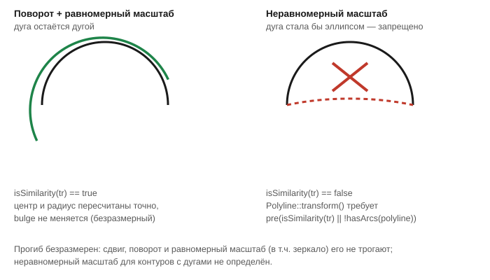

# Трансформации

Заголовок: [`include/geo/util.h`](../include/geo/util.h).

Прогиб безразмерен (отношение стрелы к полухорде, см.
[Vertex и bulge](vertex-and-bulge.md)), поэтому сдвиг, поворот и
**равномерный** масштаб его не трогают вовсе, а зеркало лишь разворачивает
обход дуги — меняет знак. Неравномерный же масштаб превращает дугу в
эллипс, которого в bulge-виде нет, поэтому для полилиний **с дугами** он
запрещён.



## bulge-вид (`Polyline`/`Polylines`)

```cpp
bool isSimilarity(const QTransform& tr);
bool hasArcs(const Polyline& polyline);

Polyline& transform(Polyline& polyline, const QTransform& tr); // pre(isSimilarity(tr) || !hasArcs(polyline))
Polylines& transform(Polylines& polylines, const QTransform& tr);

Polyline& translate(Polyline& polyline, QPointF offset);
Polylines& translate(Polylines& polylines, QPointF offset);

Polyline& rotate(Polyline& polyline, double angle, QPointF center = {}); // градусы
Polylines& rotate(Polylines& polylines, double angle, QPointF center = {});
```

`isSimilarity(tr)` — единственный вопрос, который решает, годится ли
трансформация для контура с дугами: только при подобии (поворот +
равномерный масштаб, возможно с зеркалом) дуга остаётся дугой.
`transform()` объявлен с контрактом `pre(isSimilarity(tr) || !hasArcs(polyline))`
— неравномерный масштаб контура **с дугами** это нарушение предусловия, а
не тихо неверный результат.

Операторы — тонкая обёртка для тех, кому естественнее писать
`contour * tr`, чем `Geo::transform(contour, tr)`:

```cpp
Polyline operator*(Polyline polyline, const QTransform& tr);
Polyline& operator*=(Polyline& polyline, const QTransform& tr);
Polylines operator*(Polylines polylines, const QTransform& tr);
Polylines& operator*=(Polylines& polylines, const QTransform& tr);
```

`*=` — на месте (bulge-вид это умеет буквально), `*` — копией.

## Точный домен (`Polygon`/`Polygons`)

```cpp
Polygon transformed(const Polygon& polygon, const QTransform& tr);
Polygons transformed(const Polygons& polygons, const QTransform& tr);

Polygon operator*(const Polygon& polygon, const QTransform& tr);
Polygon& operator*=(Polygon& polygon, const QTransform& tr);
Polygons operator*(const Polygons& polygons, const QTransform& tr);
Polygons& operator*=(Polygons& polygons, const QTransform& tr);
```

Для точного домена трансформация — **не** операция на месте: регион
пересобирается из контуров тем же свипом, что и при любом другом входе.
Зеркало вдобавок разворачивает обход каждого контура, и канон ориентаций
(внешняя против часовой, дырки по часовой) восстанавливается явно. У
`Polygon`/`Polygons` `*=` там просто присваивает результат обратно, но
синтаксис одинаков с bulge-видом.

Поворот и масштаб точного пути не имеют (иррациональный `cos`/`sin` негде
хранить в рациональном домене CGAL) и проходят через bulge-вид — тем же
`transform()`, что и выше, с тем же контрактом подобия.

### Перенос — особый, точный до бита

```cpp
Polygon translated(const Polygon& polygon, QPointF offset);
Polygons translated(const Polygons& polygons, QPointF offset);
```

Перенос **тела** в точном домене — без выхода в `double` и обратно: прямые
и окружности сдвигаются по своим коэффициентам (по центру у окружности), а
не пересчитываются заново из округлённых координат.

У `Geo::transformed()` на редких контурах (три опорные точки дуги почти
коллинеарны) обратная сборка дуги по трём точкам после округления в
`double` изредка берёт не ту ветвь окружности — большую вместо малой,
удваивая площадь почти вдвое (регрессия, зафиксированная тестом
[`translationPreservesAreaOfComplexArcBoundary`](../tests/test_polygon.cpp)).
`Geo::transformed()` сама пользуется путём через `translated()`, когда
трансформация оказывается чистым переносом (`QTransform::TxTranslate`) —
самый частый случай на практике: перенос вспышки апертуры Gerber в точку
на плате. Вызывать `translated()` напрямую нужно только тем, кому нужен
именно перенос, а не общая трансформация — в остальных случаях
`Geo::transformed()` уже делает правильный выбор сама.

## Дальше

* [Vertex и bulge](vertex-and-bulge.md) — почему прогиб безразмерен.
* [Polygon и Polygons](polygon-and-polygons.md) — точный домен, в котором
  `transformed`/`translated` пересобирают геометрию.
