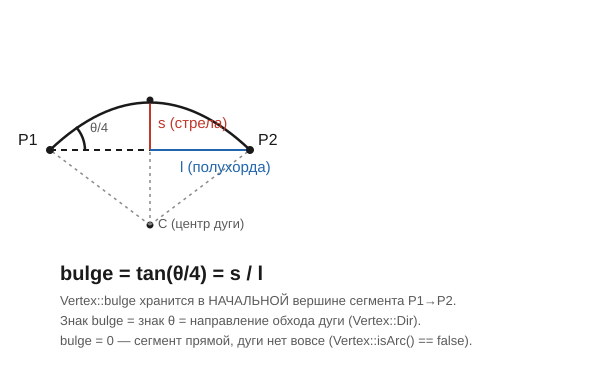
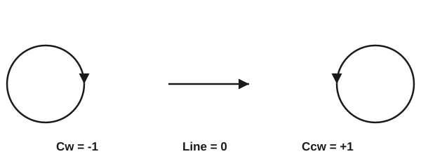

# Vertex и bulge

Заголовок: [`include/geo/polyline.h`](../include/geo/polyline.h) (тип `Vertex`),
[`include/geo/util.h`](../include/geo/util.h) (`Arc`, `arcOf`, `arcSweep`, `bulgeOf`).

## Прогиб (bulge)

`Geo::Vertex` — это `QPointF` плюс одно число, `bulge`. Прогиб описывает
кривизну сегмента, который начинается в этой вершине и идёт к следующей:
`bulge == 0` — сегмент прямой, любое другое значение — дуга. Соглашение
знакомо всем, кто работал с DXF `LWPOLYLINE` (группа 42) — Geo сознательно
использует то же самое представление, потому что это самый компактный
точный способ задать дугу через две точки без лишней вершины «центр».

Геометрически:

```
bulge = tan(θ/4) = s / l
```

где `θ` — знаковый угол дуги (центральный угол между двумя точками), `s` —
стрела (sagitta, расстояние от середины хорды до дуги), `l` — половина
длины хорды.



Знак `bulge` — это знак `θ`, то есть направление обхода дуги, а не
произвольная метка: `Vertex::dir()` вычисляется прямо из знака.

```cpp
struct Vertex : QPointF {
    enum Dir { Cw = -1, Line = 0, Ccw = 1 };

    Vertex(double x, double y, double b = {});
    double bulge{};

    bool isArc() const noexcept;   // bulge != 0
    Dir dir() const noexcept;      // знак bulge
};
```



Из этого следует несколько практических вещей:

* **Прогиб безразмерен.** Перенос, поворот и равномерный масштаб его не
  меняют вовсе — дуга остаётся дугой с тем же `bulge`, просто через другие
  точки. Подробнее — [Трансформации](transform.md).
* **Полный оборот прогибом не выразить.** При `θ → 2π` `tan(θ/4) → ∞`, и
  окружность приходится резать хотя бы на две дуги. Отсюда —
  `Geo::circle()` строит две полуокружности с `bulge = ±1`, а не одну
  вершину. См. [`maxBulgeSweep`](../include/geo/util.h) — размах, который
  прогибом ещё выражается: `2π - 1e-9`.
* **Прогиб больше единицы — законная дуга** больше полуокружности; центр у
  неё считается той же `arcOf`.

## Arc — восстановленная дуга

`Vertex` умышленно не хранит ни центр, ни радиус — только двумерную кривизну
через `bulge`. Полное описание дуги (`Arc`) восстанавливается по требованию,
на время расчёта: рисования, длины, площади, вывода G2/G3.

```cpp
struct Arc {
    QPointF center;
    double radius{};     // всегда > 0
    double startAngle{}; // atan2 в начальной точке, радианы
    double theta{};       // знаковый угол дуги, радианы: > 0 -- против часовой

    Vertex::Dir dir() const noexcept;
    double endAngle() const noexcept;
    double length() const noexcept;
    QPointF pointAt(double t) const noexcept; // 0 -- начало, 1 -- конец
    double segmentArea() const noexcept;      // площадь кругового сегмента
};

std::optional<Arc> arcOf(QPointF p1, QPointF p2, double bulge);
```

`arcOf` возвращает `nullopt` для прямого (`bulge == 0`) или вырожденного
(точки совпали) сегмента — вызывающему не нужно проверять это заранее.

Обратная задача — построить `bulge` по паре точек, центру и направлению —
нужна там, где дуга приходит извне именно так (DXF `ARC`, G-код `G2`/`G3`):

```cpp
double arcSweep(QPointF p1, QPointF p2, QPointF center, Vertex::Dir dir);
double bulgeOf(double theta);
double bulgeOf(QPointF p1, QPointF p2, QPointF center, Vertex::Dir dir);
```

## `exitWeldTolerance`

```cpp
inline constexpr double exitWeldTolerance = 1e-4; // мм
```

Расстояние, ниже которого две точки одной полилинии считаются одной — на
выходе из точного домена и во всём, что идёт следом ([`clipOpen`](clip-open.md),
[`zigzagFill`](fill.md), [`stitchArcs`](polyline.md#stitcharcs)).

Величина выбрана не на глаз, а по замеру распределения длин сегментов
(файл `gerber1.gbr`, фреза 1 мм): шум разбиения точного свипа лежит в
диапазоне 1e-9…1e-5 мм, настоящая геометрия начинается с 1e-3 мм, а на
1e-4 у офсетных контуров уже пусто. Порог стоит ровно в этом промежутке.

Число важно не только как допуск сравнения — им же задан **шаг сетки
вывода**: G-код пишет координаты целыми в единицах этого допуска. Если бы
домен и вывод считали иначе, точки, которые G-код печатает одинаковыми,
домен мог бы всё ещё различать — и наоборот. Конкретно это защищает от
одного неприятного случая: свип режет границу на куски и в местах касания
рождает обрывки в десятки нанометров. У такого обрывка есть прогиб — и в
G-коде он превращается в дугу, чьи X/Y после округления совпадают с
предыдущими координатами. Координаты подавляются как неизменившиеся,
остаются одни I/J — а строка вида `G2 I.. J..` для станка означает
**полный круг**, а не обрывок в десятки нанометров.

## Дальше

* [Polyline и Polylines](polyline.md) — как из `Vertex` строится контур,
  примитивы (`circle`, `rectangle`, `obround`, `arc`), `segments()`.
* [Трансформации](transform.md) — какие преобразования сохраняют дугу дугой.
